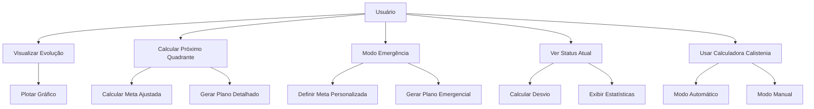
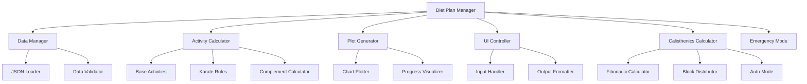

## 🔄 Diagramas (Atualizados)

### Diagrama de Casos de Uso

```mermaid
graph TD
    U[Usuário] --> A[Visualizar Evolução]
    U --> B[Calcular Próximo Quadrante]
    U --> C[Modo Emergência]
    U --> D[Ver Status Atual]
    U --> E[Usar Calculadora Calistenia]
    
    A --> A1[Plotar Gráfico]
    B --> B1[Calcular Meta Ajustada]
    B --> B2[Gerar Plano Detalhado]
    C --> C1[Definir Meta Personalizada]
    C --> C2[Gerar Plano Emergencial]
    D --> D1[Calcular Desvio]
    D --> D2[Exibir Estatísticas]
    E --> E1[Modo Automático]
    E --> E2[Modo Manual]
```

### Diagrama de Componentes

```mermaid
graph TD
    A[Diet Plan Manager] --> B[Data Manager]
    A --> C[Activity Calculator]
    A --> D[Plot Generator]
    A --> E[UI Controller]
    A --> F[Calisthenics Calculator]
    A --> G[Emergency Mode]    
    
    B --> B1[JSON Loader]
    B --> B2[Data Validator]
    
    C --> C1[Base Activities]
    C --> C2[Karate Rules]
    C --> C3[Complement Calculator]
    
    D --> D1[Chart Plotter]
    D --> D2[Progress Visualizer]
    
    E --> E1[Input Handler]
    E --> E2[Output Formatter]
    
    F --> F1[Fibonacci Calculator]
    F --> F2[Block Distributor]
    F --> F3[Auto Mode]
```